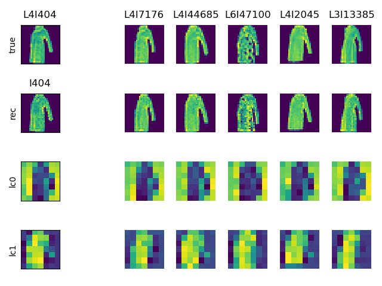
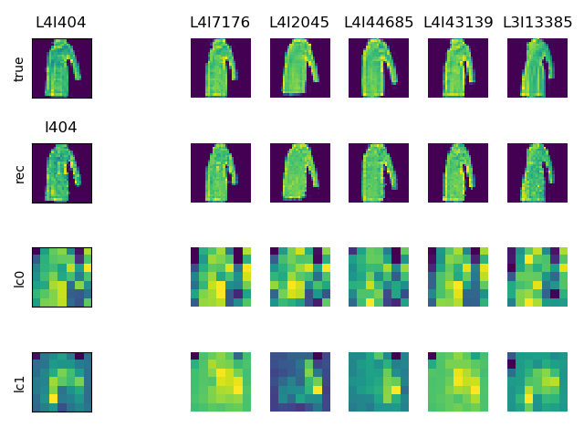
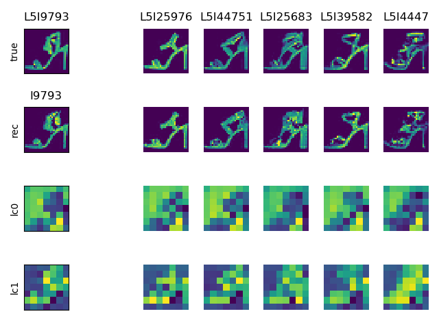
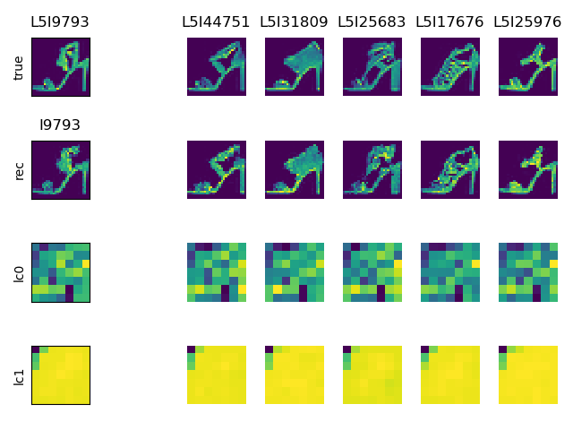
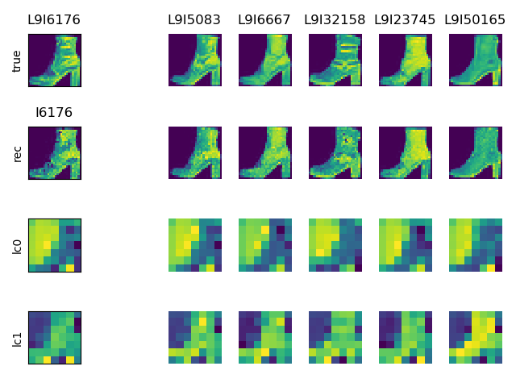
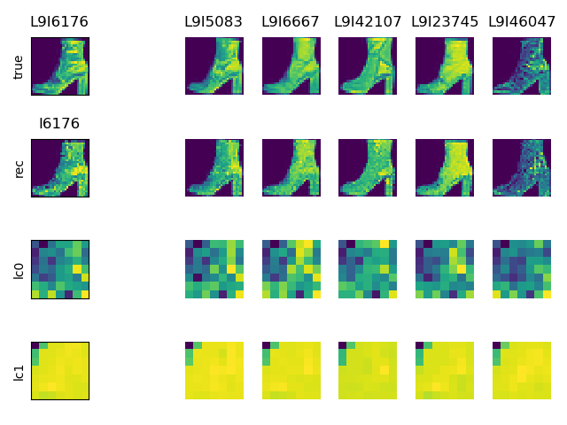
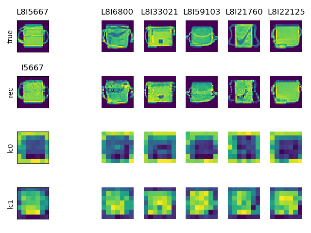
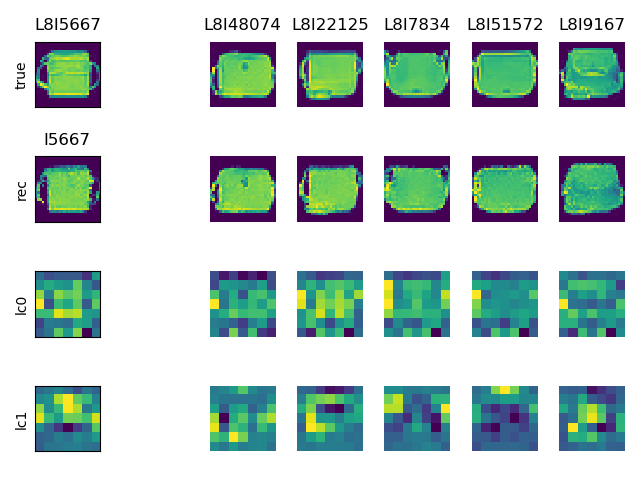
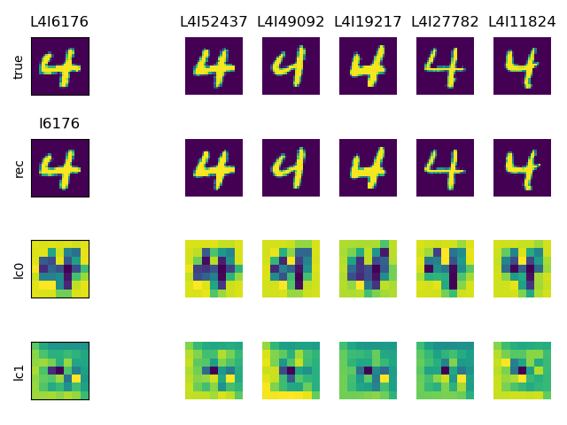
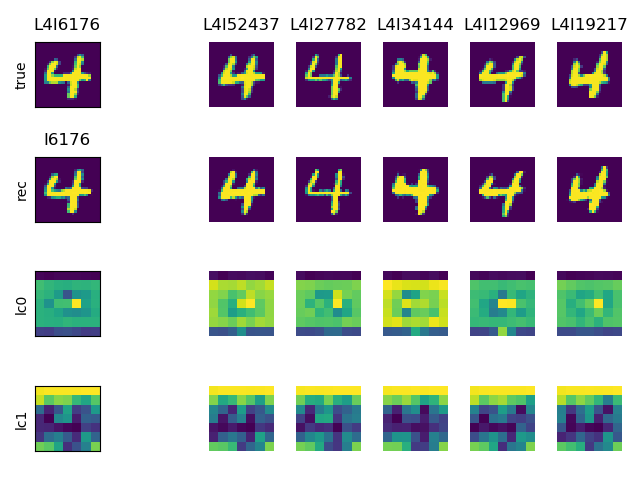

# ACN

Implementation of Associative Compression Networks for Representation Learning ([ACN](https://arxiv.org/abs/1804.02476)) by Graves, Menick, and van den Oord. We also tried using a [VQ-VAE](https://arxiv.org/abs/1711.00937) style decoder (named acnvq) 

# Examples of how to train and sample  

### Train fashion_mnist acn
```
python train_acn.py --dataset_name FashionMNIST
```

### Train mnist acn-vq
```
python train_acn.py --dataset_name MNIST --vq_decoder
```
 
### Plot reconstructions of neighbors, pca, tsne from a trained model:   
```
python train_acn.py -l path_to_model.pt --sample --pca --tsne
```
# Results

In the following table, we look at various aspects of the learned ACN codebook and reconstructions. 
We trained a KNN classifier on the ACN codes and report accuracy on the validation set of FashionMNIST and MNIST. We also show a PCA and TSNE plot for the ACN codebook of each model with points colored according to their true label. 

| Data Type | Eval | ACN | ACN-VQ |   
| --- | --- | --- | --- | 
| Fashion | KNN Accuracy | 89% | 89% |  
| Fashion | PCA | [fashion-acn-pca](results/fashion_acn/fashion_acn_validation_00_0032400000ex_pca_valid.html) | [mnist-acnvq-pca](results/fashion_acnvq/fashion_acnvq_validation_small_vq_01_0078000000ex_pca_valid.html) |   
| Fashion | TSNE | [fashion-acn-tsne](results/fashion_acn/fashion_acn_validation_00_0032400000ex_tsne_valid_P10.html) | [mnist-acnvq-pca](results/fashion_acnvq/fashion_acnvq_validation_small_vq_01_0078000000ex_tsne_valid_P10.html) |   
| MNIST | KNN Accuracy | 97% | 97% |  
| MNIST | PCA | [mnist-acn-pca](results/mnist_acn/mnist_acn_validation_01_0024000000ex_pca_valid.html) | [mnist-acnvq-pca](results/mnist_acnvq/mnist_acn_vq_vq_00_0024600000ex_pca_valid.html) |   
| MNIST | TSNE | [mnist-acn-tsne](results/mnist_acn/mnist_acn_validation_01_0024000000ex_tsne_valid_P10.html) | [mnist-acnvq-pca](results/mnist_acnvq/mnist_acn_vq_vq_00_0024600000ex_tsne_valid_P10.html) |   

In the images in the following table, we encode an example from the validation set (upper/leftmost image) and look at its nearest neighbors (right columns) according to the learned ACN model. Reconstructions of codes are shown in the second row of each image. Each channel from the ACN codebook (of size 2,7,7) is shown in the bottom two rows of each image. Notice the differences in the ACN codes of the pure ACN (left column) and ACN-VQ (right column).  Each column in the image
is denoted by its label (L) and its index into the training dataset (I). 

| ACN | ACN-VQ | 
| --- | --- |
|  |  |    

|  |  |    

|  |  |    

|  |  |    

|  |  |   

